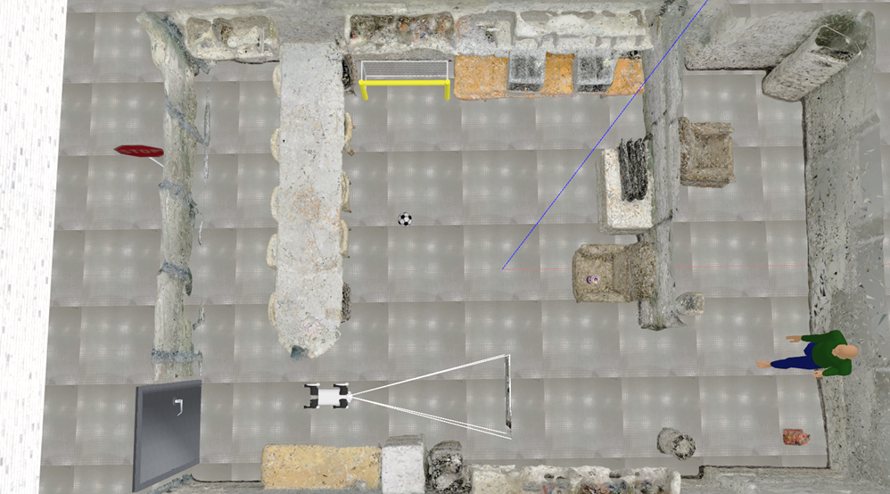
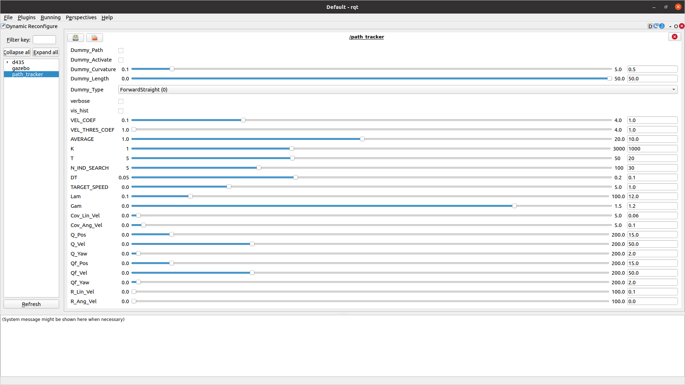

# CRAIP: Creating Robot Artificial Ingelligence Project

## Overview
CRAIP is the final project for the **"How to Make a Robot with Artificial Intelligence (M2177.002600), Fall 2024"** course.

CRAIP is developed using the Language-Image-based Mobile Robot (LIMBO) framework, designed to enable robots to perform navigation tasks based on language instructions.

### LIMBO Components
- **Gazebo Indoor Simulation Environment**: Provides a simulated indoor environment for robot operation. ([Running Gazebo World](#running-gazebo-world))
- **LLM-Based Goal Selector**: Parses language instructions into landmarks for the robot to navigate to. ([LLM-based Goal Selector](#llm-based-goal-selector))
- **Subgoal Coordinate Filter**: Extracts landmark poses in world coordinates for accurate navigation. ([Subgoal Coordinate Filter](#subgoal-coordinate-filter))
- **D-star Path Planner**: Generates optimal paths to the designated goal. ([Path Planner](#path-planner-d-lite))
- **MPPI Controller**: Handles low-level control to execute smooth navigation along the planned path. ([Controller MPPI](#controller-mppi))


## Requirements
- Anaconda or Miniconda
- ROS (Only tested in ROS Noetic, Ubuntu 20.04)

## Setup
### Cloning the Repository
```bash
git clone https://github.com/Taekmino/craip.git
```

### Setting Conda Environment
Our default installation method is based on Conda package and environment management:
```bash
cd <path to repository>
conda env create -f env.yml
conda activate limbo
```

### Downloading Simulated Testbed Files
<p align="center">
  
</p>

#### 1. Download pre-built maps
   Pre-built maps are used for planning and grounding landmarks. Download maps of our testbed from [this link](https://drive.google.com/file/d/1xkIp8XQRsPKTbIlrBQj1t0VS0C8tq9kO/view?usp=sharing). Then follow the below commands:
   ```bash
   cd <path to repository>/src/vlmaps
   mkdir -p data/vlmaps
   ```
   Unzip `vlmaps.zip` and put the maps under `<path to repository>/src/vlmaps/data/vlmaps`.

   You can easily unzip via `unzip <path to home directory>/Downloads/vlmaps.zip -d <path to repository>/src/vlmaps/data/vlmaps`. 

#### 2. Download mesh
   - [Mesh](https://drive.google.com/file/d/1oGNUDJ-lhuVAYgKpygG1Ph2kobFab0qU/view?usp=sharing)

   Locate `209.dae` under `<path to repository>/src/environment/models/209/meshes/`

#### 3. Download texture file
   - [Texture](https://drive.google.com/file/d/1a0dp3MZHVsyE3Tn6OrTq3F3uB5uDPXk7/view?usp=drivesdk)

   Locate `209_texture.png` under `<path to repository>/src/environment/models/209/materials/textures/`

#### 4. Install dependencies and set environmental variables
   To successfully interact with the quadruped robot, you should install additional Debian packages.
   ```bash
   sudo apt update
   sudo apt install liblcm-dev ros-noetic-move-base ros-noetic-controller-interface ros-noetic-gazebo-ros-pkgs ros-noetic-gazebo-ros-control ros-noetic-joint-state-controller ros-noetic-effort-controllers ros-noetic-joint-trajectory-controller
   ```
   Then, export the environment variable to successfully load the downloaded model of our testbed to the Gazebo simulator.
   ```bash
   export GAZEBO_MODEL_PATH=$GAZEBO_MODEL_PATH:<path to repository>/src/environment/models

   # ex) export GAZEBO_MODEL_PATH=$GAZEBO_MODEL_PATH:/home/aril/craip/src/environment/models
   ```

#### 5. Build the Project
   Once all the files are downloaded and dependencies are installed, you need to build the project using catkin_make. This command will compile the code and set up the environment for further execution.

   Navigate to the root of your catkin workspace and run:

   ```bash
   cd <path to repository>  
   catkin_make
   ```

#### 6. Source the Workspace
After the build completes successfully, source the workspace to update your environment with the new packages:

```bash
source devel/setup.bash
```
By sourcing this file, you'll ensure that ROS can locate and use the new packages and models in your setup.

## Mission


### Common Mission
   1. Avoid a slowly approaching person
   2. Score a goal
   3. Pass through a slowly opening door without bumping into it
   4. Stop at the stop sign (3 seconds)
### Additional Mission
   - Each team will be asked to propose a mission. 
   - If you need assistance with any part of the mission implementation, the teaching assistants will be available to help. 
   - If a mission is deemed unfeasible, it may be declined.

  _You may use any type of robot and any method to complete the mission. 
  Detailed evaluation criteria will be announced later._ 

## Navigating with Custom User Instruction
To execute the basic language navigation task, run the manual below.

1. Gather necessary files for navigation via following [Setup](#setup).
2. Run the Gazebo simulator. ([Running Gazebo World](#running-gazebo-world))
   ```bash
   export GAZEBO_MODEL_PATH=$GAZEBO_MODEL_PATH:<path to repository>/src/environment/models
   roslaunch unitree_gazebo go1_209.launch
   ```
   In another terminal, run the following command to spawn Go1 in the simulator:
   ```bash
   roslaunch unitree_guide go1_spawner.launch
   ```
3. Open the Web page to pass a user instruction via following [Running LLM-based Goal Selector](#llm-based-goal-selector).
4. Launch the language navigation system.
   ```bash
   roslaunch limbo limbo.launch
   ```
5. Enter the language instruction on the LLM web page and click the submit button.
   

# Descriptions of each module
## Running Gazebo World
### Spawn Go1 and All Objects at Once
Run the launch file to open gazebo world.
```bash
export GAZEBO_MODEL_PATH=$GAZEBO_MODEL_PATH:<path to repository>/src/environment/models
roslaunch unitree_gazebo go1_209.launch
```

In another terminal, run the following commnad to spawn Go1 and set objects in the simulator.
```bash
roslaunch dynamic_objects mission_setting.launch
```

### Delete Go1 and Respawn Go1
Sometimes, go1 may fall over. In such cases, delete go1 in Gazebo and respawn go1 only. 

Run the following command to delete go1.
```bash
rosservice call gazebo/delete_model '{model_name: go1_gazebo}'
```

Run the following commnad to respawn Go1 in the simulator.
```bash
roslaunch unitree_guide go1_spawner.launch
```

If the Go1 is flipped after spawning, increase `/stand_wait_count` in the `go1_spawner.launch`.

If the Go1 sinks after spawning, increase `/move_base_wait_count` in the `go1_spawner.launch`.

### Reset Environment to Initial Settings
If you want to return to the initial settings, run the command below. 
```bash
roslaunch dynamic_objects reset_environment.launch
```
If the reset completes successfully, terminate the launch file by pressing `Ctrl+c`.

### Manual Control of Go1 
To control Go1, run the following command in another terminal.
```bash
roslaunch test_zone teleop_key.launch
```

## Publishing Map Node
 Publish obstacle map (`obstacles.npy`) and cost map (`costmap.npy`) with the following command.
```bash
roslaunch vlmaps publish_map.launch 
```

## Subgoal Coordinate Filter
### Executing Subgoal Coordinates Filter
Given a list of landmarks, subgoal coordinate filter extracts navigable coordinate with respect to an agent. Related commands are as follows.
1) To compute the coordinates and visualize the grounded results directly,
```bash
cd <path to repository>/src/vlmaps/scripts
python filter_subgoal_coord.py --init_coord <x_coordinate>, <y_coordinate> --lang {object you want} --vis

# ex)  python filter_subgoal_coord.py --init_coord 30,40 --lang table sofa chair --vis 
```
2) To publish the subgoal coordinate via ROS,
```bash
roslaunch vlmaps publish_subgoal_coordinates.launch 
```
This launch file emits the coordinate of the first landmark immediately. Publication of the following coordinates are driven by an arrival signal (`/subgoal_arrived_topic`) from path planner.

## Path Planner (D* Lite)
### Running D-star Lite planner

To run the D-star planner, 
```bash
roslaunch path_planner path_planner.launch
```

## Controller (MPPI)
### Running MPPI
To run the MPPI controller,

```bash

roslaunch path_tracker path_tracker.launch
```

### Tuning MPPI Parameters
1.  Go to `<path to repository>/src/planning/path_tracker/config` and open `mppi.yaml`.
2.  Set `dynamic_config : True`.
3.  Run Gazebo Simulator and Spawn turtlebot following [Running Gazebo World](#running-gazebo-world).
4.  Run MPPI in another terminal following [Running MPPI](#running-mppi).
5.  Run `rviz` in another terminal and open `<path to repository>/src/planning/path_tracker/config/mppi.rviz`.
6.  In another terminal, run `rqt`.
7.  Tune MPPI parameters using several types of dummy path and see how the robot moves through RViz. 


## LLM-based Goal Selector
### List of Methods
- Server
- GPT (optional)
- [Ollama](https://github.com/ollama/ollama) (optional)

You have to choose one of the LLM methods that you want to use.

#### Server
To operate this module, you may use the server. If you choose to use the server, the available models are `llama3.1:8b` and `gemma2:2b`. For the final evaluation, high-performance models like llama3.1:70b will also be made available. When running the module on the server, make sure to record the usage time and send it to the following email before starting.
`hanbi218@snu.ac.kr`

#### GPT (optional)
Use open ai API keys to run GPT model for this module.
If you want to choose this method, it requires OpenAI API keys.
To receive the OpenAI API key and use it for the module, follow these steps:

1. Sign Up for an OpenAI Account
   If you do not already have an OpenAI account, you will need to create one.
   Visit the [OpenAI API website](https://openai.com/index/openai-api/).
   Click on the **Sign Up** button in the middle.
   Fill out the required information (name, email, and password).
   Verify your email address by clicking the link sent to your email.
   You can also sign in using your Google, Microsoft, or Apple account.

2. Access the API Keys Section
   Once logged in, navigate to the [API Keys page](https://platform.openai.com/account/api-keys).
   You may need to accept the terms and conditions if you haven't done so already.

3. Set Up Billing
   To use the OpenAI API, you need to set up billing for your account.
   Navigate to the [Billing page](https://platform.openai.com/account/billing) on the OpenAI website.
   Click on the **Set up payment method** button.
   Enter your payment details (credit card information or other accepted payment methods).
   Review and confirm your billing information.
   Once your billing is set up, you can start using the OpenAI API with your new API key.


4. Generate a New API Key
   On the API Keys page, click the **Create new secret key** button.
   A dialog will appear with your new API key. **Important:** Copy this key immediately. You won't be able to view it again after this dialog is closed.

5. Secure Your API Key
   Your API key is a sensitive piece of information. Follow these best practices to keep it secure:
   - **Do not share your API key** with anyone.
   - **Do not hard-code your API key** directly in your source code. Use environment variables or a configuration management tool.
   - **Regenerate your API key** if you suspect it has been compromised.

6. Put Your API Key into an Environment Variable
   ```bash
   vim ~/.bashrc
   ```
   Press i to write. 
   Write `export OPENAI_API_KEY=<your_api_key_here>` at the bottom of the file.
   Press `esc` and write `:wq` to save the file.
   After saving the file, run the following command:
   ```bash
   source ~/.bashrc
   ```
                
The default GPT model is GPT-4o, but if you want to change it, add `--gpt <GPT model that you want>` to the command.
You can watch model list at [this link](https://platform.openai.com/docs/models).
We implemented our module with `gpt-4o`.

#### Ollama (optional)
Use Ollama to run a local LLM for this module.
If you want to choose this method, it requires Ollama.

Install Ollama and download LLM with this method.
``` bash
# Install Ollama
curl -fsSL https://ollama.com/install.sh | sh
# Download LLM in your local enviroment
ollama pull <llm you want> 
```
If you couldn't install Ollama via the command line, you can install it on the [Ollama webpage](https://ollama.com/).
You can check the Ollama-supported LLM list in the [Ollama library link](https://ollama.com/library).
Our default LLM in Ollama is LLaMA3:70b but we also checked with LLaMA3:8b.
If you want to change the LLM, add `--ollama <Ollama model that you want>` to the command.
70b models require a high-end GPU. If your GPU is not powerful enough, please switch to a lower model.
Tested models are `llama3:8b` and `llama3:70b`.

### Running the Goal Selector Module

`goal_selector_web.py` is a main source sript for running user interface in webpage and parse subgoals via LLMs.

Once you have decided how the goal selector will operate, you can run the module through the following steps.

```bash
cd <path to repository>/src/llm
# Using Server
streamlit run goal_selector_web.py -- --llm server --ollama llama3.1:8b

# Using GPT
streamlit run goal_selector_web.py -- --llm gpt --gpt gpt-4o

# Using Ollama
streamlit run goal_selector_web.py -- --llm ollama --ollama llama3.1:8b
```
The default setting is to parse the code. However, if you only want to perform simple landmark parsing, proceed as follows.

```bash
# Using Server
streamlit run goal_selector_web.py -- --llm server --ollama llama3.1:8b --prompt landmark

# Using GPT
streamlit run goal_selector_web.py -- --llm gpt --gpt gpt-4o --prompt landmark

# Using Ollama
streamlit run goal_selector_web.py -- --llm ollama --ollama llama3.1:8b --prompt landmark
```
Once all the steps are completed, the goal selector should run properly.